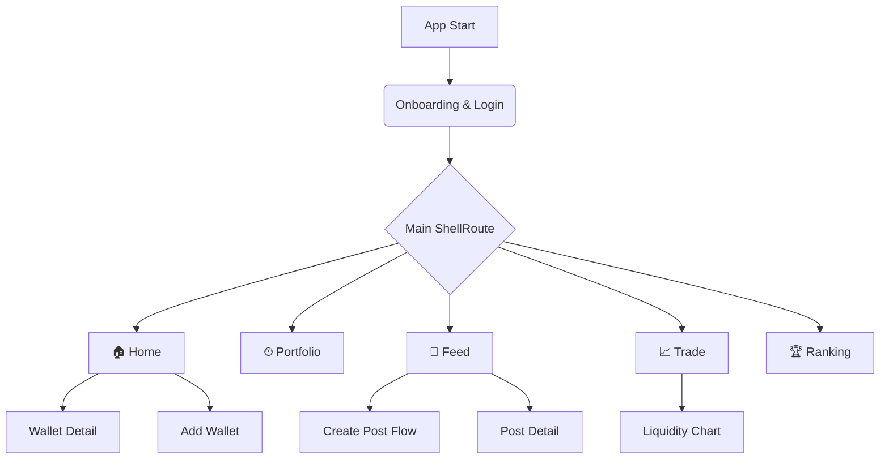

# ILITY Mobile App PRD v4.0

**Product Requirements Document**

| 항목 | 내용 |
| --- | --- |
| **문서 버전** | **4.0** (Unified & Tech-Enhanced) |
| **작성일** | 2025-12-18 |
| **작성자** | Product Team |
| **상태** | **Approved for Development** |
| **대상 플랫폼** | iOS, Android (Flutter) |
| **개발 전략** | UI-First (Mock Data 선행) → Web3 Integration |

---

## 1. Executive Summary

### 1.1 제품 개요

ILITY는 **멀티체인 Web3 지갑**과 **소셜 트레이딩**을 결합한 올인원 모바일 애플리케이션입니다 . 
단순 자산 조회를 넘어, 온체인 트랜잭션을 기반으로 신뢰할 수 있는 소셜 피드를 생성하고, 앱 내에서 즉각적인 DeFi 활동(Swap, Liquidity Provision)을 지원합니다.

### 1.2 핵심 가치 제안

* 
**Trustless Social**: 검증된 트랜잭션 기반 포스팅으로 허위 정보 차단.


* 
**Seamless DeFi**: 복잡한 DEX UI(Tick Spacing 등)를 모바일 친화적으로 재해석.


* 
**Gamification**: 자산 가치(TVF) 기반 랭킹 시스템 도입.


### 1.3 목표 지표

* 
**지갑 연결 성공률**: 98%+ (Deep Link 최적화 필수).


* 
**크래시율**: < 0.5% (금융 앱 수준 안정성).


---

## 2. 지원 네트워크 및 지갑 전략

2.1 지원 블록체인 네트워크 

| 네트워크 | Chain ID | Native Token | RPC 전략 |
| --- | --- | --- | --- |
| **ILITY Network** | TBD | ILY | Primary Provider (자체 노드) |
| **Ethereum** | 1 | ETH | Infura / Alchemy Fallback |
| **BNB Chain** | 56 | BNB | Public RPC + Rate Limit 관리 |
| **Base** | 8453 | ETH | Coinbase Base Node |

2.2 지원 지갑 및 연결 방식 (Priority) 

> **Tech Note**: `reown_appkit` (구 WalletConnect v2)을 메인으로 사용하되, UX를 위해 Deep Link 처리를 정교하게 구현해야 함.

1. **MetaMask** (Deep Link / WC) - Default 1
2. **Rabby Wallet** (WC) - Default 2
3. **Phantom** (Deep Link) - Default 3
4. **Extended Support**: OKX, Trust, Coinbase Wallet

---

3. 앱 구조 (Information Architecture) 

### 3.1 Navigation Structure



---

## 4. 상세 기능 명세 (Functional Specifications)

### 4.1 Login & Wallet Connection

4.1.1 Wallet Selection (Login_01) 

* **Accordion UI**: 'Other wallets' 클릭 시 하단으로 리스트 확장 애니메이션.
* **Terms Consent**: "By connecting your wallet..." 문구 필수 노출.

4.1.2 Connection Process States (Login_02) - 중요 

지갑 연결 과정을 4단계 상태 머신(State Machine)으로 관리하여 사용자 이탈을 방지합니다.

| 단계 | UI 텍스트 | 상태 표시 | Trigger Event |
| --- | --- | --- | --- |
| **1** | Opening wallet app | ✅ Green / ⏳ Loading | Deep Link 실행 시점 |
| **2** | Waiting for authorization | ⏳ Loading + Alert | 앱 생명주기(Resume) 감지 |
| **3** | Verifying signature | ⏳ Loading | 지갑 서명 데이터 수신 대기 |
| **4** | Connection complete | ✅ Green | 서명 검증 및 세션 생성 완료 |

* **Continue 버튼**: 4단계가 모두 완료(✅)되어야 활성화(`isEnabled = true`).
* **Deep Link Alert**: "ILITY wants to open [WalletName]" 시스템 다이얼로그 처리.

---

### 4.2 Main & Portfolio

4.2.1 Asset Aggregation Logic 

* **Total Asset Value**: 연결된 모든 지갑(N)의 합산 가치.
* 로직: `Sum(Wallet A USD + Wallet B USD + ...)`
* 
**Interaction**: `$0.00`에서 실제 금액까지 카운팅 애니메이션 (`TweenAnimationBuilder` 권장).


* **Wallet Cards**:
* 첫 번째 카드는 **ILITY Network** 고정 (삭제 불가).


* 추가 지갑은 우측 상단 `X` 버튼으로 삭제 가능.
* 최대 **5개** 지갑 연결 제한.


4.2.2 Wallet Detail (Main_02) 

* **Token vs Contract 분리**:
* 일반 토큰: Symbol, Balance, USD Value 표시.
* DeFi 프로토콜 자산: "Contracts" 섹션으로 별도 그룹핑 (`2 Contracts $6,040.50`).


---

### 4.3 Profile System

4.3.1 Profile Validation Rules 

API 호출 비용 절약 및 UX를 위해 클라이언트 사이드 검증을 우선 수행합니다.

| 필드 | 제약 조건 | 에러 메시지 (Toast/InputError) | 변경 주기 |
| --- | --- | --- | --- |
| **Name** | 2~50자 | "Please enter between 2 and 50 characters." | 7일 |
| **Username** | 4~15자, 영문/숫자/_ | "Username must be 4-15 chars, letters/numbers/_ only." | 30일 |
| **Bio** | 2~150자 | "Please enter between 2 and 150 characters." | 상시 |

* **Username 중복 체크**: 입력 멈춤(debounce 500ms) 후 API 조회.
* 중복 시: "Username is already in use.".


4.3.2 Privacy Settings 

* **Private Account**: Off (기본). On 시 프로필 검색 제외.
* **Show Portfolio Value**: On (기본). Off 시 금액 마스킹(`****`).

---

### 4.4 Feed & Posting System

4.4.1 Create Post Flow (FE_07 ~ FE_10) 

트랜잭션 데이터를 Social Proof로 사용하는 핵심 기능입니다.

1. **Select Wallet**: 연결된 지갑 중 트랜잭션이 있는 지갑 목록 표시.
2. **Select Transactions**:
* 
**최대 2개** 중복 선택 가능.


* Timestamp 기준 최신순 정렬.
* 데이터: Type(Swap/Transfer...), Network, TxHash(축약), Amount, Net-worth.


3. **Content Writing**:
* 
**Text**: 최대 240자.


* 
**Tags**: 최대 3개, 태그당 10자 제한 (영문만) .


* **Validation Error**: "Each tag can have up to 10 characters." / "Only English letters..." .


4.4.2 Feed List UX 

* **Action Buttons**:
* 본인 글: `Meatball Menu` -> `Delete`
* 타인 글: `Meatball Menu` -> `Report`


* **Floating Action Button (FAB)**: 피드 탭 진입 시 하단에서 Spring Animation으로 등장.

---

4.5 Trade & Liquidity Chart (Technical Focus) 

#### 4.5.1 Liquidity Chart Logic (TP_03, TP_04)

유동성 집중 범위를 설정하는 인터랙티브 차트입니다. `Fee Tier`에 따라 `Tick Spacing`과 줌 레벨이 달라지는 로직 구현이 필요합니다.

**Tick Spacing 및 차트 설정 로직:**

| Fee Tier | 적합한 Pair 유형 | 기본 Range (Tick) | 차트 X축 단위 |
| --- | --- | --- | --- |
| **0.01%** | Stable (USDC/USDT) | ±2 ticks | 0.0002 |
| **0.05%** | Standard (ETH/USDC) | ±10 ticks | 0.0002 |
| **0.3%** | Most Pairs | ±20 ticks | 0.0005 |
| **1.0%** | Volatile (Meme coins) | ±100 ticks | 0.001 |

* **Zoom Control**: `-` / `+` 버튼으로 차트 스케일 조정 (기본 10.0x).
* **Interactive Range**: 차트 내 핸들러 드래그 또는 버튼(±0.1%, Full Range) 클릭 시 Min/Max Price Input 자동 업데이트.

4.5.2 Slippage Settings 

* Presets: 0.1%, 0.5% (Default), 2.5%.
* Custom: 사용자 직접 입력 가능.

---

## 5. UI/UX 디자인 가이드

### 5.1 Color System (Dark Theme)

| Role | Hex | Description |
| --- | --- | --- |
| **Background** | `#1E1E1E` | App Background |
| **Surface** | `#2D2D2D` | Card / Modal Background |
| **Primary** | `#3182CE` | Action Buttons, Active States |
| **Success** | `#10B981` | Connection Success, Price Up |
| **Error** | `#EF4444` | Validation Error, Price Down |
| **Text Primary** | `#FFFFFF` | Headings, Main Data |
| **Text Secondary** | `#9CA3AF` | Captions, Subtitles |

### 5.2 Animations

* **Spring Animation**: Feed FAB, Bottom Sheets 등장 시.
* **Counting**: 자산 가치 표시 ($0 -> $10,000).
* **Accordion**: 지갑 목록 확장/축소.
* **Slide Transition**: 화면 간 이동 (GoRouter Custom Transition).

---

## 6. 기술 스택 및 개발 아키텍처 (Recommended)

Flutter 3년 차 개발자 및 "UI-First" 접근법을 고려한 스택 제안입니다.

### 6.1 Frontend (Flutter)

* **State Management**: `Riverpod` (전역 상태, 비동기 데이터 처리에 최적).
* **Navigation**: `go_router` (Deep Link 처리 및 Nested Route 용이).
* **Web3**:
* `reown_appkit` (WalletConnect v2 필수 - 구 Web3Modal).
* `web3dart` (RPC 통신 및 잔고 조회).
* `decimal` (암호화폐 정밀 연산 필수).


* **UI Components**:
* `fl_chart` (커스텀 Liquidity Chart 구현).
* `flutter_svg` (암호화폐 아이콘).
* `cached_network_image` (NFT 및 프로필 이미지).


### 6.2 Data Flow (UI-First Strategy)

1. **Repository Interface 정의**: `WalletRepository`, `FeedRepository` 등 추상 클래스 먼저 정의.
2. **Mock Repository 구현**: JSON 데이터를 반환하는 Mock 구현체로 UI 개발 완료 (Backend 의존성 제거).
3. **Real Repository 교체**: 개발 후반부에 실제 Web3/API 연동 구현체로 DI(Dependency Injection) 교체.

---

## 7. 개발 마일스톤 (Schedule)

총 21주 (약 5개월) - Mock Data 기반 UI 선행 개발 전략

| Phase | 기간 | 주요 작업 내용 | Tech Focus |
| --- | --- | --- | --- |
| **1** | W1-2 | 프로젝트 셋업, 테마/라우팅, Mock 구조 설계 | Riverpod, GoRouter |
| **2** | W3-5 | **Wallet Connection UI** (Mock), 온보딩 플로우 | State Machine |
| **3** | W6-8 | **Main & Portfolio** (자산 합산 로직, Mock Data) | CustomScrollView |
| **4** | W9-11 | **Feed System** (CRUD, 리스트 렌더링 최적화) | ListView, Sliver |
| **5** | W12-14 | **Trade & Chart** (Liquidity Chart 커스텀 구현) | fl_chart Custom |
| **6** | W15-17 | **Real API Integration** (Feed, User Data) | Dio, Retrofit |
| **7** | W18-19 | QA, 최적화, 스토어 배포 준비 | Profiling |
| **8** | W20-21 | **Web3 Integration** (WalletConnect v2, 인증 API) | reown_appkit |

> ⚠️ **우선순위 조정**: Web3 Integration (WalletConnect v2 지갑 서명, Nonce → Sign → JWT 인증)은 **가장 마지막 단계**에서 구현합니다.

---

## 8. 데이터 모델링 (Core Entities)

### 8.1 Wallet

```dart
class Wallet {
  final String address;
  final NetworkType network; // enum: ILITY, ETH, BNB, BASE
  final String connectionId; // WalletConnect Session ID
  final List<Token> tokens;
  final List<ProtocolAsset> protocols; // Contracts 섹션용
}

```

### 8.2 Posting

```dart
class Posting {
  final String id;
  final User author;
  final String content;
  final List<String> tags;
  final List<TransactionInfo> transactions; // 선택된 Tx 정보
  final int likeCount;
  final int commentCount;
  final DateTime createdAt;
}

```

---

## 9. 예외 처리 및 정책 (Edge Cases)

* **네트워크 혼잡**: RPC 응답 지연 시 "Updating balances..." 스낵바 표시 후 기존 캐시 데이터 유지.
* **가스비 부족**: 트랜잭션 발생(Trade, Posting 등) 시 가스비 견적(Estimation) 후 잔액 부족하면 즉시 Alert.
* **이미지 로드 실패**: 프로필/토큰 이미지 로드 실패 시 `Initials` 또는 `Default Placeholder` 아이콘 표시.
* **지갑 연결 끊김**: 세션 만료 또는 연결 해제 감지 시 즉시 로그인 화면으로 리다이렉트 처리 (`GoRouter`의 `redirect` 로직 활용).

---

**문서 끝**